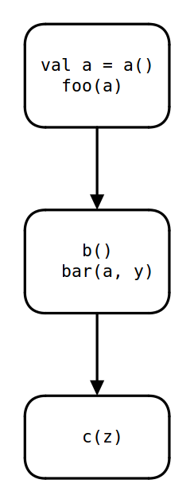

<!-- .slide: style="font-size: 60%" -->

## Kotlin Coroutine 的实现

[摘自官网](http://kotlinlang.org/docs/reference/coroutines.html#the-inner-workings-of-coroutines)

> Coroutines are completely implemented through a compilation technique 
  (no support from the VM or OS side is required), and suspension works through
  code transformation. Basically, every suspending function (optimizations may
  apply, but we'll not go into this here) is transformed to a state machine where
  states correspond to suspending calls ...  
  <br>
<!-- .element: style="margin:auto; font-size: 70%; text-align: left;" -->

> ... The type of such objects is Continuation, and the overall code transformation
  described here corresponds to the classical Continuation-passing style. Consequently, 
  suspending functions take an extra parameter of type Continuation under the hood.
<!-- .element: style="margin:auto; font-size: 70%; text-align: left;" -->

大致有几层意思
- 完全依赖编译, 不需要 VM 或 OS 层提供支持
- 任务调度依赖 CPS 转换 
- 异步函数会被编译为有限状态自动机, 记录执行位置以及本地变量 (closure)

<!-- .element: style="font-size: 70%" -->

---

### Finite State Machines

有限自动机

---

<iframe width="560" height="315" data-src="https://www.youtube.com/embed/2lQBsMVAK5o" frameborder="0" allowfullscreen></iframe>

---


```kotlin
val a = a()
val y = suspend foo(a)     // suspension point
b()
val z = supspend bar(a, y)) // suspension point
c(z)
```
<!-- .element: style="font-size: 30%; position:absolute; top: 10%; left: 61%; z-index: 10; " -->



<!-- .element: width="244" height="632" -->
<!-- .element: style="zoom: 60%; position:absolute; top: 30%; left: 80%; z-index: 10; " -->
<!-- .element: class="fragment" data-fragment-index="2" -->

```java
class _anonymous_for_state_machine_ implements Continuation/* <...> */ {
    // The current state of the state machine
    int label = 0

    // local variables of the coroutine
    A a = null
    Y y = null

    void resume(Object data) {
        if (label == 0) goto L0
        if (label == 1) goto L1
        if (label == 2) goto L2
        else throw IllegalStateException()

      L0:
        // data is expected to be `null` at this invocation
        a = a()
        label = 1
        await(foo(a), this) // 'this' is passed as a continuation 
        return
      L1:
        // external code has resumed this coroutine passing the result of await() as data 
        y = (Y) data
        b()
        label = 2
        await(bar(a, y), this) // 'this' is passed as a continuation
        return
      L3:
        // external code has resumed this coroutine passing the result of await() as data 
        Z z = (Z) data
        c(z)
        label = -1 // No more steps are allowed
        return
    }          
}
```
<!-- .element: style="font-size: 30%" -->
<!-- .element: class="fragment" data-fragment-index="3" -->

